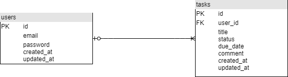

# 簡易仕様書

## アプリ名
課題管理用アプリケーション
## 対象OS
+ Windows,Linux,Mac
## 開発環境/言語
+ vagrant
+ Linux(Ubuntu 18.04)/PHP 7.4(フレームワーク:Laravel)
+ postgresql 12.6
## 機能概要(機能一覧)
+ タスクの追加機能
+ タスクの参照機能
## フレームワークのバージョン
+ Laravel Framework 6.20
## テーブル定義(ER図)など

## 構築方法
### ubuntuでのインストール方法
1. PHP7.4のインストールを行う。
    ```
    $ sudo apt update
    $ sudo apt -y install php7.4
    ```
2. Composerを使用するために必要なライブラリをインストールする。

    ```
    $ sudo apt install curl php7.4-cli php7.4-mbstring git unzip
    ```
3. Composerを以下のサイトを参考にインストールする。
    * https://getcomposer.org/download/ ここを参考にcomposerのインストールを行う。
4. Composerコマンドを使えるようにする。
    ```
    $ sudo mv composer.phar /usr/local/bin/composer #(composer.pharの移動と名前変更)
    $ sudo chmod +x /usr/local/bin/composer #(実行権限を付ける)
    $ composer --version #(バージョン確認)
    ```
5. gitからcloneを行いローカル環境に落としてくる。
    ```
    $ git clone https://github.com/Narita-1095305/auth-task.git
    ```
6. アプリをブラウザ表示できるようにする。
    ```
    $ composer install
    $ cp .env.example .env
    ```
    * 先ほど作られた.envファイルは環境設定どおりに設定する。　
    以下はpostgresqlを用いた場合の設定である。
    ```
    DB_CONNECTION=pgsql
    DB_HOST=127.0.0.1
    DB_PORT=5432
    DB_DATABASE={データベース名}
    DB_USERNAME={データベースを管理しているユーザ名}
    DB_PASSWORD={データベースのパスワード}
    ```
    * migrate実行
    ```
    $ php artisan migrate
    ```
    * サーバーを立ち上げる
    ```
    $ php artisan serve --host 0.0.0.0
    ```

## コンセプト
+ 課題が多い大学向けの人のための、提出日の締切を忘れないためのリスト。
## こだわったポイント
+ ログイン、ログアウト機能
+ パスワード再設定フォームを作成した
+ 視線の流れを意識してデザインを行った
+ マージンを意識して書いた
+ 締切日がわかるように書いた
## アドバイスして欲しいポイント
+ 全体的なUIについてどのように改善すれば使いやすくなるかといった点
+ 他にどのような機能が欲しいかという点
+ レスポンシブ化をする際にどのようなデザインであると見やすいかといった点
## デザイン面に関して見て欲しいポイント
+ ヘッダーとフッターを準備しているため、最低限は見やすくなっているといった点
+ 色で進捗状況を分けているために一目でわかりやすいという点
+ テーブルデザイン
